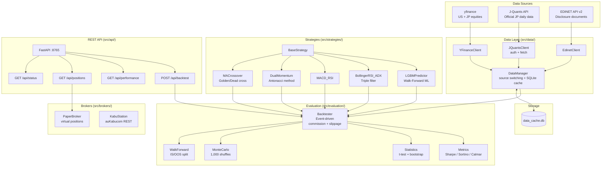

# AI Trader Expansion

> AI-powered stock trading with Walk-Forward evaluation

Multi-strategy trading system for Japanese and US equities with rigorous out-of-sample validation, Monte Carlo stress testing, and a REST API for AI assistant integration.

[](LICENSE)
[](https://www.python.org/)
[](tests/)
[](docs/SPEC.md)

## Features

- **5 Trading Strategies** — MA Crossover, Dual Momentum (Antonacci), MACD+RSI, Bollinger+RSI+ADX, LightGBM Walk-Forward ML
- **Walk-Forward Analysis** — In-sample / out-of-sample split with t-test and bootstrap confidence intervals to prevent overfitting
- **Monte Carlo Simulation** — 1,000-shuffle robustness test with Sharpe / Sortino / Calmar metrics
- **Multi-Source Data** — yfinance (US + JP), J-Quants API (official JP equities), EDINET API v2 (disclosure documents), SQLite cache
- **Broker Adapters** — Paper trading (virtual orders + position management) and kabuSTATION (au Kabucom REST API)
- **SHANON REST API** — `/api/status`, `/api/positions`, `/api/performance`, `/api/backtest` endpoints for AI assistant integration
- **Production-Grade Design** — Immutable DataFrames, full type hints, environment-variable secrets, 80%+ test coverage

## Quick Start

```bash
# 1. Clone and install
git clone https://github.com/yourorg/ai-trader-expansion.git
cd ai-trader-expansion
pip install -r requirements.txt

# 2. Set API credentials (optional — yfinance works without keys)
export JQUANTS_REFRESH_TOKEN=your_token
export EDINET_API_KEY=your_key

# 3. Run a demo backtest
python scripts/demo_backtest.py

# 4. Start the REST API server
python -m src.api.server          # http://localhost:8765

# 5. Run all tests
pytest
```

## Architecture



## Documentation

| Document | Description |
|----------|-------------|
| [docs/SPEC.md](docs/SPEC.md) | Full API specification |
| [docs/MANUAL.md](docs/MANUAL.md) | Setup and operations guide |
| [docs/TEST_LIST.md](docs/TEST_LIST.md) | Test case catalogue |
| [docs/ARCHITECTURE.mmd](docs/ARCHITECTURE.mmd) | Detailed Mermaid architecture diagram |

## Contributing

1. Fork the repo and create a feature branch (`git checkout -b feat/your-feature`)
2. Write tests first — maintain 80%+ coverage (`pytest --cov=src`)
3. Follow immutable data patterns: never mutate DataFrames in-place, return copies
4. Submit a pull request with a description of what and why

Please read [docs/SPEC.md](docs/SPEC.md) for design conventions before contributing.

## License

Apache 2.0 — see [LICENSE](LICENSE)
